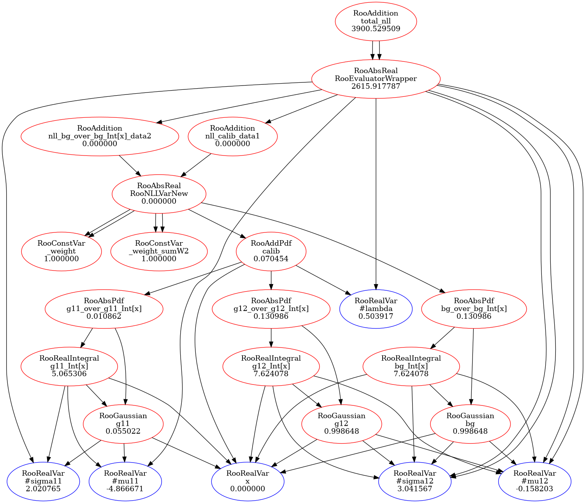

# Statistics_tutorial

## Statistical Data Analysis in Particle Physics

This repository offers a high-level introduction to statistical data analysis in particle physics. It covers essential concepts, methodologies, and tools for extracting meaningful insights from experimental data. The focus is on building a solid foundation in statistical techniques through practical examples and visualizations.

## Overview

Particle physics experiments produce vast amounts of data, and statistical analysis is vital for interpreting the results. This repository demonstrates how to:

* Construct and fit statistical models to experimental data
* Visualize likelihood functions and parameter uncertainties

Included are Jupyter notebooks, visualizations, and code examples to guide you through the process of statistical data analysis.

---

## Visualizations

### Likelihood Ratio Profile Animation

The animation below illustrates the profile likelihood ratio (PLR) method, a technique for estimating parameter uncertainties and testing hypotheses in particle physics.


---

### Model Graph

The graph below shows the structure of the statistical model used in one of the examples. These graphs represent models constructed based on an understanding of the system under study. Each component corresponds to a specific aspect of the system being modeled. While they may resemble neural networks, the arrangement of variables and the overall structure of the network are motivated by a deep understanding of the data—for example, the physics underlying the data.




---

## Repository Structure

```
Statistics_tutorial/
├── .gitignore
├── Model_graph.png
├── README.md
├── Statistics_tutorial.pdf   # Introduction to statistics in particle physics.
├── Slides_1.ipynb   # The code used to produce the figures in the tutorial PDF.
├── Slides_2.ipynb   # The code used to produce the figures in the tutorial PDF.
├── Tutorial.ipynb   # A Jupyter tutorial for statistical data analysis using ROOT.
├── compiled_model/
│   ├── Compton_1step.cxx
│   ├── Compton_1step.h
│   ├── Compton_1step_cxx.so
│   └── ...
└── plr_plots/
    ├── animated.gif
    └── ...
```

* **`Statistics_tutorial.pdf`**: Set of slides introducing statistical data analysis in particle physics.
* **`Tutorial.ipynb`**: Main tutorial notebook covering core concepts in statistical data analysis and implementation.
* **`Slides_1.ipynb` & `Slides_2.ipynb`**: Supplementary notebooks for presentations.
* **`compiled_model/`**: Compiled C++ inference model to speed up inference.
* **`plr_plots/`**: Visualizations and animations related to the profile likelihood ratio.
* **`Model_graph.png`**: A graph for an inference model discussed in Tutorial.ipynb.

---

## 🚀 Getting Started

Follow these steps:

1. **Clone the repository**:
   ```bash
   git clone git@github.com:atasattari/Statistics_tutorial.git
   cd Statistics_tutorial
   ```

2. **Install dependencies**:
   
   Make sure the following packages are available:
   - NumPy
   - Matplotlib  
   - ROOT (see [installation guide](https://root.cern/install/))

3. **Start Exploring**:
   
   Check the slides and the Notebooks
---

## 📘 What's Inside

Explore the included notebooks to get started with statistical data analysis in particle physics.


